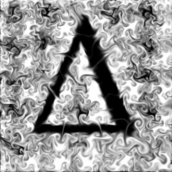

  

# DeltaFlow

DeltaFlow is a GPU-accelerated differentiable fluid simulator written in JAX.

By taking derivatives through the entire simulation, you can optimize simulation inputs with gradient descent. 
For example, you could find initial velocities that carefully orchestrate fluid particles to form an image. 
Take that, entropy!

Since it's end-to-end JAX, it's composable with other differentiable JAX components. 
For example, you could use [Haiku](https://github.com/deepmind/dm-haiku) to train a neural network to interact with the fluid simulator, 
and since the environment is fully differentiable you wouldn't need reinforcement learning. 

Also, it's fast. On a recent GPU, DeltaFlow can run a 4K simulation at 40 FPS. 
Smaller simulations often achieve hundreds of frames per second, even when computing gradients.

## Usage

The main API is two functions: `simulate()`, which runs a fluid simulation, and `step()`, which runs a single step. 
Both are differentiable with respect to their vector field inputs.

For detailed usage examples, see the notebooks under `examples/`.

## Documentation

TODO

## Installation

TODO
